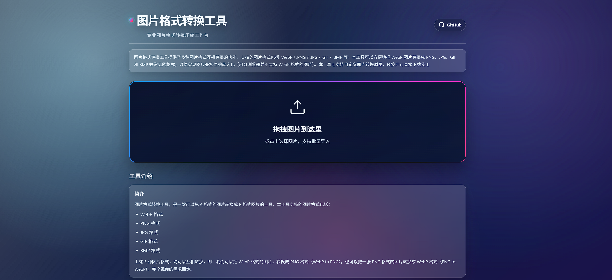

# 🖼️ 图片格式转换工具 (Image Converter)

一个功能强大的在线图片格式转换与压缩工具，支持**批量上传、批量处理、批量下载**，完全在浏览器中运行，无需上传到服务器，**纯前端实现，隐私安全**。

## 📸 截图

<div align="center">
  
</div>

## ✨ 功能特点

- 📤 **批量上传** — 支持一次选择/拖拽多张图片，高效处理
- 🔄 **格式转换** — 支持 JPEG、PNG、WebP 格式互转
- 🗜️ **批量压缩** — 所有图片一键压缩，可调节压缩质量（10%-100%）
- 📏 **尺寸缩放** — 支持多种尺寸缩放选项（100%、75%、50%、25%）
- 👁️ **实时预览** — 实时显示每张图片的压缩效果和文件大小对比
- 📊 **详细统计** — 显示原图和压缩后的文件大小、尺寸、压缩率
- ⬇️ **批量下载** — 所有处理完成的图片一键打包下载
- 📱 **响应式设计** — 完美适配 PC 和移动端
- 🔒 **隐私保护** — 所有处理都在本地浏览器中进行，无数据上传
- 🆓 **完全免费** — 代码开源，无需注册

## 🚀 快速开始

### 本地运行

```bash
# 克隆仓库
git clone https://github.com/aiyoubucuoyou/image-converte.git
cd image-converte

# 启动本地服务（任选一种）
python -m http.server 8000        # Python
# php -S localhost:8000            # PHP
# npx serve .                      # Node.js

# 访问
# http://localhost:8000
```

也可以直接在浏览器中打开 `index.html` 文件。

## 🎯 使用指南

### 1. 批量上传图片
- **点击上传区域** — 打开文件选择器，可多选图片
- **拖拽图片** — 直接拖拽多张图片到上传区域

### 2. 调节压缩参数

| 参数 | 说明 | 推荐值 |
|------|------|--------|
| 压缩质量 | 10%-100%，越低文件越小 | 照片 75-85%，网页 70-80% |
| 尺寸缩放 | 100%/75%/50%/25% | 按需选择 |
| 输出格式 | JPEG/PNG/WebP | 照片用 JPEG，图形用 PNG |

### 3. 批量下载
- 所有图片处理完成后，点击"全部下载"按钮一键打包下载
- 也可以单独下载某张图片

## 📁 项目结构

```
image-converte/
├── index.html      # 主页面
├── styles.css      # 样式文件
├── script.js       # 核心逻辑
├── icon.png        # 网站图标
├── screenshot.png  # 截图预览
├── LICENSE         # MIT 许可证
└── README.md       # 项目说明
```

## 🛠️ 技术栈

- **HTML5 + CSS3 + 原生 JavaScript**
- **Canvas API** — 图片压缩处理
- **Blob API** — 文件处理和下载
- **纯静态文件** — 可部署到任意静态托管服务

## 🌐 浏览器兼容性

| 浏览器 | 支持情况 |
|--------|---------|
| Chrome | ✅ 完全支持 |
| Firefox | ✅ 完全支持 |
| Safari | ✅ 完全支持 |
| Edge | ✅ 完全支持 |

## 📝 注意事项

1. **隐私保护** — 所有图片处理都在本地浏览器中进行，不会上传到任何服务器
2. **文件大小限制** — 受浏览器内存限制，建议处理 50MB 以下的图片
3. **格式支持** — 支持所有常见图片格式（JPEG、PNG、GIF、WebP、BMP 等）

## 🤝 贡献

欢迎提交 Issue 和 Pull Request！

## 📄 许可证

[MIT License](LICENSE) — 自由使用、修改和分发。

---

<div align="center">
  如果觉得有用，请给个 ⭐ Star 支持一下！
</div>
